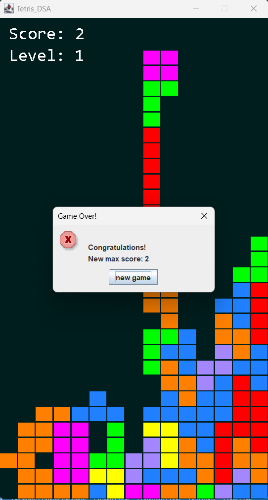

@ -2,102 +2,104 @@
_**This is a mini project of Algorithms & Data Structures course.**_
### Table Of Content.
- [Table Of Content.](#table-of-content)
- [1.Background](#1background)
  - [1.1 Student Information](#11-student-information)
  - [1.2 Introduction](#12-introduction)
  - [1.3 How to run](#13-how-to-run)
- [2.Game](#2game)
  - [2.1: About the game](#21-about-the-game)
  - [2.2 How to play](#22-how-to-play)
  - [2.3 Game rules](#23-game-rules)
- [3.Algorithms \& Data Structures](#3algorithms--data-structures)
- [4.Class Diagrams](#4class-diagrams)
  - [GameBoardPanel](#gameboardpanel)
  - [Tetromino](#tetromino)
  - [GameWindow](#gamewindow)

### 1.Background
#### 1.1 Student Information
- **Name:** Tran Quynh Nhu
- **Student ID:** ITDSIU21105
- **Mail:** ITDSIU21105@student.hcmiu.edu.vn
#### 1.2 Introduction
This is the game i created for the project of Algorithm & Data Structures. Tetris (Russian: Тетрис[a]) is a puzzle video game created in 1985 by Alexey Pajitnov, a Soviet software engineer. In Tetris, players complete lines by moving differently shaped pieces (tetrominoes), which descend onto the playing field. The completed lines disappear and grant the player points, and the player can proceed to fill the vacated spaces. The game ends when the uncleared lines reach the top of the playing field. The longer the player can delay this outcome, the higher their score will be.

#### 1.3 How to run
**Step 1:** Clone this Repository from GitHub.

    git clone https://github.com/tronldau/DSA.git

**Step 2:** Open the project source code folder in VS Code or any other IDE that supports Java language and check the file status.

    git status

**Step 3:** Run the game and play.
### 2.Game
#### 2.1: About the game
- Language: Java
- Library: JavaSwing
- Game Engine: Java2D
#### 2.2 How to play
|  Control |  Keyboards |
|---|---|
| Move left  |   ←  |
| Move right |  → |
| Rotate blocks | ↑ |
| Drop: Soft| ↓ |
| Drop: Hard | Space |
#### 2.3 Game rules
The game of Tetris is a classic puzzle game where players rotate and arrange falling blocks called Tetrominos to create a solid line without gaps. The game ends when the blocks reach the top of the playing field.

### 3.Algorithms & Data Structures
The game implementation uses the following data structures and algorithms:

- 2D arrays to represent the game board and Tetrominos
- Enum to represent the different types of Tetrominos
- Timer to control the game speed
- Random number generator to generate random Tetrominos
- Looping and conditional statements to implement game logic
### 4.Class Diagrams
#### GameBoardPanel
**Attributes:**

- **'BoardWidth'** and **'BoardHeight'**: constants representing the width and height of the game board
- **'gameBoard'**: a 2D array representing the game board
- **'curBlock'**: the current Tetromino
- **'curX'** and **'curY'**: the current position of the Tetromino
- **'timer'**: a Timer object to control the game speed
- **'currentScore'**: the current score of the game
  
**Methods:**
- **'start()'**: starts the game
- **'pause()'**: pauses the game
- **'newTetromino()'**: generates a new Tetromino
- **'advanceOneLine()'**: advances the Tetromino one line down
- **'advanceToEnd()'**: advances the Tetromino to the bottom of the game board
- **'removeFullLines()'**: removes full lines from the game board
- **'GameOver()'**: ends the game and displays the final score
#### Tetromino

**Attributes:**

- **'tetrominoes'**: an enum representing the different types of Tetrominos
- **'coords'**: a 2D array representing the coordinates of the Tetromino
- **'tetrominoTable'**: a 3D array representing the different shapes of Tetrominos
  
**Methods:**

- **'setShape()'**: sets the shape of the Tetromino
- **'setRandomShape()'**: sets a random shape for the Tetromino
- **'getShape()'**: returns the shape of the Tetromino
- **'rotateLeft()'**: rotates the Tetromino to the left
- **'rotateRight()'**: rotates the Tetromino to the right
#### GameWindow
**Attributes:**

- **'gameBoard'**: a GameBoardPanel object
  
**Methods:**
- **'GameWindow()'**: constructor to create a new GameWindow
- **'start()'**: starts the game
